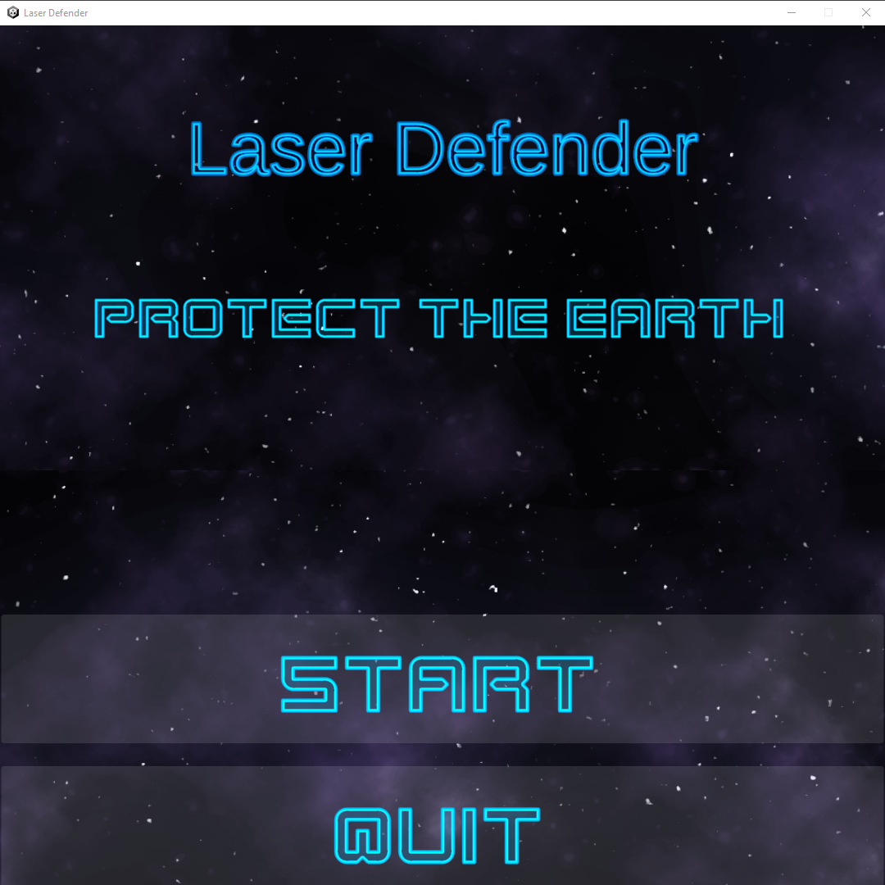
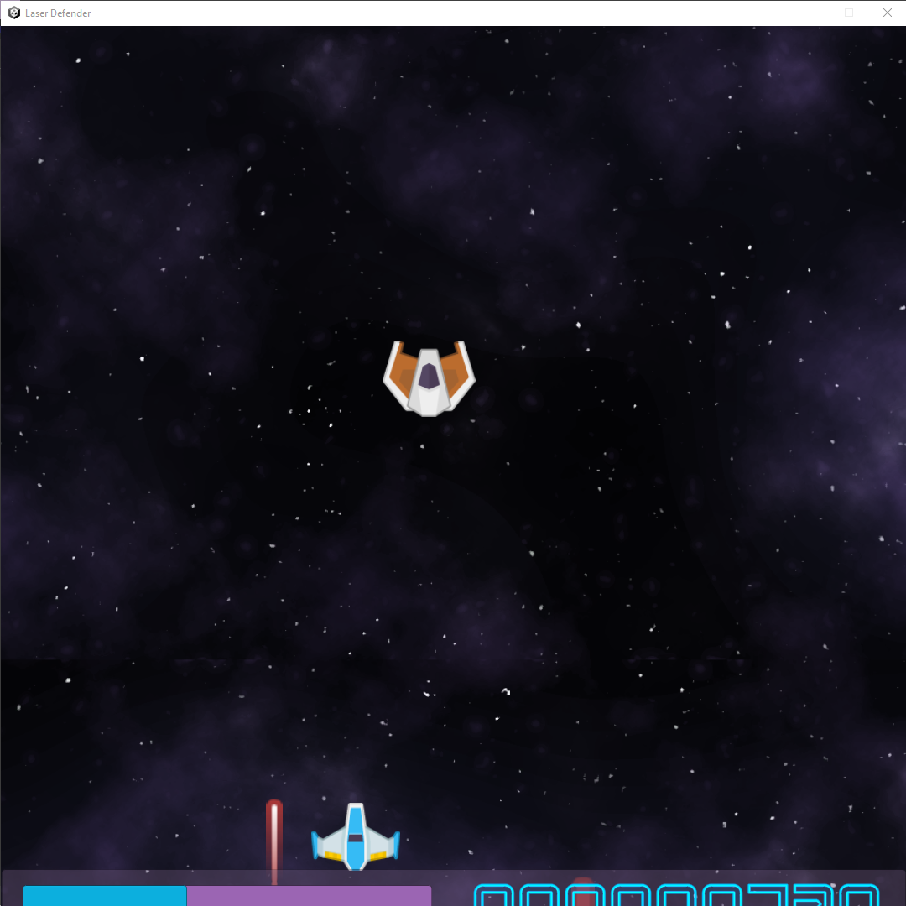
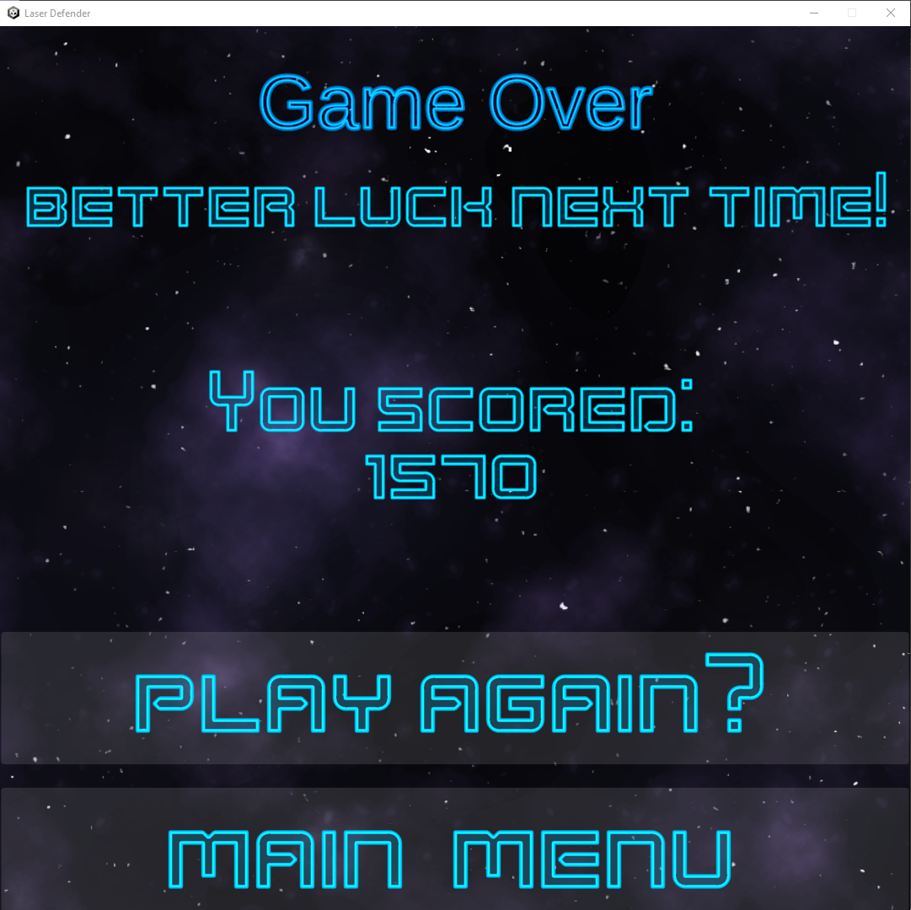

<!-- GAME PROJECT TITLE -->
# Laser-Defender---Game
Game created for study purposes by Matheus Soares Martins, in this game you control a character across a space shooter 2D game 
This game haves differents scenes (menu, game and game over) and different ships for player and enemy and their projectiles 
 
Avoid being hitten by enemies laser, and try to destroy the maximum amount of enemy ships before your health points runs out.
 

This game was made to be played by one player
 

Game Controls 
- Player controls: 
Up Arrow or W - Goes up with your ship. 
Left Arrow or A - Goes left with your ship. 
Right Arrow or D - Goes right with your ship. 
Down Arrow or S - Goes down with your ship. 
Space or Left Click - Fire a laser projectile 

******************************************************************************

 

<!-- GAME PROJECT IMAGES -->
# Screenshots

<!-- GAME PROJECT BUILDS -->
# Game download 
## Windows: https://mega.nz/folder/cMVWyabL#MMoeVYZfe60bBrnWw-gJGw
## Mac: https://mega.nz/folder/8MFUxCaY#w-aEgsOAbfH96fbbOF43Vw
## Linux:  https://mega.nz/folder/RY9S3QgS#LneE2ihSqFEOC4_xl6Rqgg